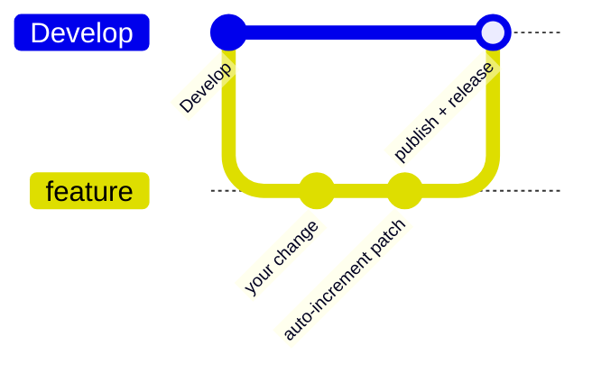

# Contributing

Thanks for helping improve `@stsoftware/tags`. This guide covers the few
conventions that are specific to this repository.

## Branch model

`Develop` is the integration branch — there is no `main`. Branch from `Develop`
and open your pull request against `Develop`.

Every push to `Develop` publishes the package to
[JSR](https://jsr.io/@stsoftware/tags) (`publish.yml`) and creates a
`v<version>` tag and GitHub Release (`github-release.yml`), so a merge is a
release.



## Quality gate

Run the local gate before pushing:

```bash
./quality.sh
```

It lints, type-checks, formats and runs the full test suite. CI runs the same
gate (`quality.yml`) on every branch other than `Develop`, so a change that
fails locally will fail in CI too.

## Version bumps

You do not normally edit the version in `deno.json` yourself.
`update-package-version.yml` runs on every pull request to `Develop` and
compares your branch's version with the base:

| Your `deno.json` version | What happens                                                                         |
| ------------------------ | ------------------------------------------------------------------------------------ |
| Same as `Develop`        | The workflow bumps the patch number and pushes `chore: auto-increment patch version` |
| Ahead of `Develop`       | Left alone — use this for a deliberate minor or major bump                           |
| Behind `Develop`         | The check fails; merge `Develop` into your branch and retry                          |

## Changelog

Add a line under `## [Unreleased]` in [CHANGELOG.md](CHANGELOG.md) for any
user-visible change. The format follows
[Keep a Changelog](https://keepachangelog.com/en/1.1.0/).

## Style

- Use British spelling in code, comments and docs (colour, behaviour); the spell
  check runs cspell with `en-GB`.
- Use Deno tooling only (`deno fmt`, `deno lint`, `deno test`) — no Node.js
  tooling.
- Keep changes small and focused, with tests that exercise real code.
