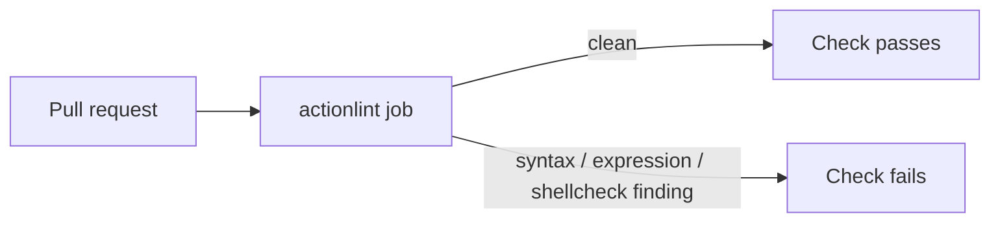
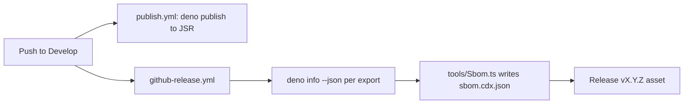

# Tags

A TypeScript utility library for managing tags on JSON objects. Tags are simple
name/value pairs attached to any object that implements `TagsInterface`. The
library provides a small, type-safe API for adding, retrieving, merging, and
removing tags, plus a CLI helper for tagging every JSON file in a directory.

## Features

- Add, retrieve, merge, and remove tags on any `TagsInterface` object
- Type-safe API with TypeScript interfaces (`TagsInterface`, `TagInterface`)
- Lazy initialisation — the `tags` array is only created when the first tag is
  added
- Bundled `TagAndRelease` class and CLI for bulk-tagging JSON files in a
  directory
- Built for the Deno runtime; published on JSR as `@stsoftware/tags`

## Installation

This module is published on [JSR](https://jsr.io). Add it to your Deno project
with:

```bash
deno add jsr:@stsoftware/tags
```

Then import from the `mod` entry point:

```typescript
import {
  addTag,
  addTags,
  getTag,
  removeTag,
  type TagsInterface,
} from "@stsoftware/tags/mod";
```

## Usage

### Basic tag operations

```typescript
import {
  addTag,
  getTag,
  removeTag,
  type TagsInterface,
} from "@stsoftware/tags/mod";

// Any object with an optional `tags` array is taggable.
const taggable: TagsInterface = {};

// Add a tag — returns the previous value if the name already existed, or null.
addTag(taggable, "hello", "world"); // returns null (new tag)
addTag(taggable, "hello", "there"); // returns "world" (replaced)

// Retrieve a tag value, or null when missing.
getTag(taggable, "hello"); // "there"

// Remove a tag; returns the removed value or null.
removeTag(taggable, "hello"); // "there"
getTag(taggable, "hello"); // null
```

### Merging tags from another object

`addTags` copies every tag from a _source_ `TagsInterface` into a _target_
`TagsInterface`. Existing tags on the target with the same name are overwritten;
unrelated tags on the target are preserved.

```typescript
import {
  addTag,
  addTags,
  getTag,
  type TagsInterface,
} from "@stsoftware/tags/mod";

const source: TagsInterface = {};
addTag(source, "category", "electronics");
addTag(source, "price", "99.99");

const target: TagsInterface = {};
addTag(target, "keep", "me");

addTags(target, source);

getTag(target, "category"); // "electronics"
getTag(target, "keep"); // "me" (unchanged)
```

## API reference

### Interfaces

| Name            | Description                                                 |
| --------------- | ----------------------------------------------------------- |
| `TagsInterface` | An entity that may carry tags: `{ tags?: TagInterface[] }`. |
| `TagInterface`  | A single tag: `{ name: string; value: string }`.            |

### Functions

| Signature                                                                      | Returns                                                                      |
| ------------------------------------------------------------------------------ | ---------------------------------------------------------------------------- |
| `addTag(taggable: TagsInterface, name: string, value: string): string \| null` | Previous value if the tag was replaced, otherwise `null`.                    |
| `addTags(target: TagsInterface, source: TagsInterface): void`                  | Nothing. Copies every tag from `source` into `target`, overwriting on clash. |
| `getTag(taggable: TagsInterface, name: string): string \| null`                | The tag value, or `null` if the tag is not present.                          |
| `removeTag(taggable: TagsInterface, name: string): string \| null`             | The removed value, or `null` if the tag was not present.                     |

### Classes

| Name            | Description                                                              |
| --------------- | ------------------------------------------------------------------------ |
| `TagAndRelease` | Reads every `*.json` file in a directory and applies a tag list to each. |

## Command-line application

The bundled `App` entry point tags every JSON file in a directory using a
comma-separated `key=value` list.

```bash
deno run --allow-read --allow-write \
  jsr:@stsoftware/tags/App \
  --directory=.creatures \
  --tagList=ABC=XYZ,HELLO=World
```

Required flags:

- `--directory` — directory containing the `*.json` files to tag
  (non-recursive).
- `--tagList` — comma-separated `key=value` pairs to add to each file.

The same behaviour is available programmatically via the `TagAndRelease` class:

```typescript
import { TagAndRelease } from "@stsoftware/tags/mod";

new TagAndRelease().process({
  directory: ".creatures",
  tagList: "ABC=XYZ,HELLO=World",
});
```

## How it fits together

```mermaid
flowchart LR
    A[Your object<br/>TagsInterface] -- addTag / addTags --> B[(tags: TagInterface[])]
    B -- getTag --> C[value or null]
    B -- removeTag --> D[removed value or null]
    E[JSON files in directory] -- TagAndRelease.process --> B
```

## Development

Run the full quality gate (lint, type-check, format, tests) locally:

```bash
./quality.sh
```

The gate (and the CI `Test` step) runs `deno test --reporter=dot`, so a green
run prints one summary line; any failure is still reported in full.

See [CONTRIBUTING.md](CONTRIBUTING.md) for the branch model and automatic
version bump, and [CHANGELOG.md](CHANGELOG.md) for release notes.

### Dependency quarantine

CI updates dependencies unattended (`deno outdated --update --latest` in
`.github/workflows/quality.yml`), so `deno.json` declares a minimum dependency
age. Deno refuses any external version published within the last 24 hours, which
stops a hijacked release from being adopted, executed and auto-pushed before it
has been noticed. Internal `@stsoftware/*` scopes are excluded from the wait and
update immediately.

```json
"minimumDependencyAge": {
  "age": "P1D",
  "exclude": ["jsr:@stsoftware/*", "npm:@stsoftware/*"]
}
```

Do not pass `--min-dep-age` on the command line in CI — the flag overrides
`deno.json` and would disable the quarantine.

### Workflow lint

Every pull request runs [actionlint](https://github.com/rhysd/actionlint) over
`.github/workflows/` (`.github/workflows/actionlint.yml`), including shellcheck
on each `run:` block, so a broken workflow fails the build before it merges. Run
the same check locally with:

```bash
actionlint -color
```



### Release SBOM

Every GitHub release carries `sbom.cdx.json`, a CycloneDX 1.5 software bill of
materials for the resolved dependency graph of each `deno.json` export. It is
generated by `tools/Sbom.ts` from `deno info --json`, in the same Develop push
that publishes to JSR. The output is deterministic and sorted, so a plain diff
of two releases' SBOMs shows exactly which dependencies changed.



To regenerate it locally, or to compare two releases:

```bash
deno run --allow-read=deno.json --allow-run=deno tools/Sbom.ts > sbom.cdx.json
gh release download v1.0.14 -p sbom.cdx.json -O old.cdx.json
diff old.cdx.json sbom.cdx.json
```

## Security

Please report vulnerabilities privately, not in a public issue. See
[SECURITY.md](SECURITY.md) for the reporting route, response times and supported
versions.

## License

This project is licensed under the MIT License — see the [LICENSE](LICENSE) file
for details.
