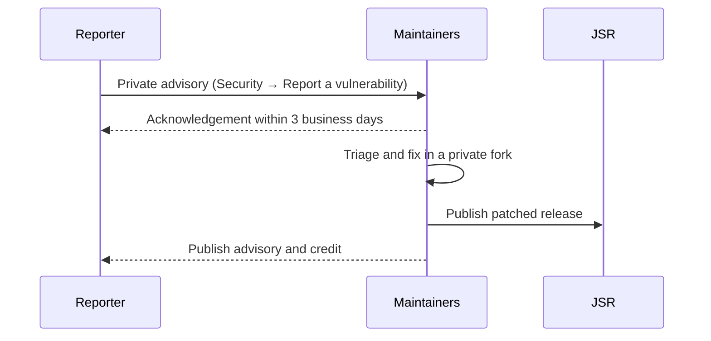

# Security Policy

This policy explains how to report a vulnerability in `@stsoftware/tags`, the
Deno library and command-line application published to
[JSR](https://jsr.io/@stsoftware/tags) from this repository, and what response
to expect.

## Supported Versions

Only the latest release of the current major version receives security fixes. If
you are pinned to an older release, upgrade to the latest `1.x` version.

| Version | Supported |
| ------- | --------- |
| 1.x     | ✅        |
| < 1.0   | ❌        |

## Reporting a Vulnerability

Please do **not** open a public GitHub issue, pull request or discussion for a
suspected vulnerability.

Report it privately through GitHub's private vulnerability reporting instead:
open the repository's **Security** tab and choose **Report a vulnerability**, or
go straight to
[the private advisory form](https://github.com/stSoftwareAU/TagsTS/security/advisories/new).

Include as much of the following as you can:

- the affected version and component (library API or `App.ts` command line);
- steps to reproduce, or a minimal proof of concept;
- the impact you expect an attacker could achieve;
- a suggested fix, if you have one.

## Response Time

- **Acknowledgement:** within 3 business days of your report.
- **Triage:** an initial assessment and severity within 10 business days.
- **Updates:** at least every 14 days until the report is resolved.

If a report is accepted, we develop the fix in a private fork of the advisory,
publish a patched release to JSR and then publish the advisory, crediting you
unless you ask us not to. If a report is declined, we explain why.

## Disclosure

Please give us a reasonable chance to release a fix before disclosing the issue
publicly, and do not access or modify data that does not belong to you while
investigating.
