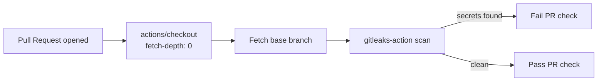

## Summary

Added the Gitleaks Secrets Detection GitHub Actions workflow at `.github/workflows/gitleaks.yml`. The workflow scans pull request diffs for committed secrets using `gitleaks-action`, with third-party actions pinned to 40-character commit SHAs to defend against tag-hijack supply-chain attacks. Closes #17.

## Evidence

This is a CI/configuration-only change — no UI or runtime code is modified, so no screenshot applies.

Verification performed:

- `./quality.sh < /dev/null` passes cleanly (deno lint, check, fmt, and all unit tests pass).
- The new workflow file mirrors the canonical NEAT-AI pattern referenced in the issue, including the `Fetch base branch` step needed for gitleaks-action's commit-range resolution.
- Third-party actions are pinned to commit SHAs:
  - `actions/checkout@11bd71901bbe5b1630ceea73d27597364c9af683` (v4.2.2)
  - `gitleaks/gitleaks-action@ff98106e4c7b2bc287b24eaf42907196329070c7` (v2.3.9)

## Test Plan

- Workflow is exercised by GitHub Actions on every pull request (`on: pull_request`); no local Deno tests apply to a CI workflow definition.
- Existing Deno test suite continues to pass: `deno test --allow-all test/*.ts` reports `4 passed | 0 failed`.
