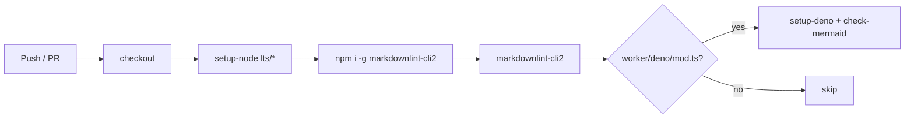

## Summary

Added the `Markdown Lint` GitHub Actions workflow at
`.github/workflows/markdown-lint.yml` so every push to the default
branches and every pull request runs `markdownlint-cli2` over the
repository's Markdown sources. The workflow follows the template from
the issue: it pins `actions/checkout`, `actions/setup-node`, and
`denoland/setup-deno` to commit SHAs, installs `markdownlint-cli2` via
npm, runs it, and conditionally invokes the Deno-based Mermaid checker
only when `worker/deno/mod.ts` is present (this repo does not ship that
module, so the Mermaid step is skipped at runtime). Closes #19.

## Evidence

Pure CI/config change — no UI. Verified locally by:

- Parsing the workflow YAML with `@std/yaml` (see test plan below).
- Running `markdownlint-cli2 README.md` locally: `0 error(s)`.
- Running `./quality.sh`: 6 tests passed, 0 failed.

## Test Plan

- Added `test/MarkdownLintWorkflow.ts` with two Deno tests:
  - `markdown-lint workflow file exists` — asserts the workflow file is
    a regular file.
  - `markdown-lint workflow parses as YAML and defines markdownlint
    job` — parses the YAML, then asserts `name`, `jobs.markdownlint`,
    `runs-on`, and that a step invokes `markdownlint-cli2`.
- Confirmed `./quality.sh` passes (`6 passed | 0 failed`).
