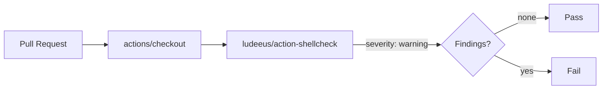

## Summary

Added the `ShellCheck` GitHub Actions workflow at
`.github/workflows/shellcheck.yml` so shell scripts in this repo (currently
`quality.sh`) are linted on every pull request and on pushes to default
branches. Third-party actions are pinned to 40-character commit SHAs per the
project's supply-chain guidelines, rather than the `@master` reference suggested
in the issue template. Closes #20.

## Evidence

This is a CI/workflow change with no UI surface. Validation:

- `shellcheck quality.sh` runs locally with no findings — the workflow will
  report a clean pass on first run.
- `./quality.sh` passes including the three new tests in
  `test/ShellCheckWorkflow.ts`.

## Test Plan

- Added `test/ShellCheckWorkflow.ts` with three Deno tests:
  - `shellcheck workflow file exists` — asserts the workflow file is present.
  - `shellcheck workflow parses as YAML and defines shellcheck job` — asserts
    structure, `runs-on`, and use of `ludeeus/action-shellcheck`.
  - `shellcheck workflow pins third-party actions to commit SHAs` — asserts
    every `uses:` reference resolves to a 40-char SHA (defence against
    supply-chain attacks).
- All 9 tests pass under `./quality.sh`.
