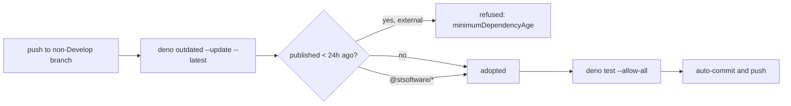

## Summary

`.github/workflows/quality.yml` runs `deno outdated --update --latest`
unattended on every non-`Develop` push, then executes the resulting dependency
tree (`deno test --allow-all`) and auto-commits/pushes the change — with no
delay between a package being published and this repository trusting it. A
release hijacked minutes earlier was adopted and run immediately (CWE-829).

This adds Deno's native supply-chain quarantine to `deno.json`, so the runtime
itself refuses any **external** dependency version published in the last 24
hours. Internal `@stsoftware/*` scopes are excluded and still update
immediately. While hardening the same workflow file, its two actions are pinned
to commit SHAs, least-privilege `permissions:` are declared, and multi-line
`run:` blocks open with `set -euo pipefail` so a failed command cannot pass
silently. Closes #36.

```json
"minimumDependencyAge": {
  "age": "P1D",
  "exclude": ["jsr:@stsoftware/*", "npm:@stsoftware/*"]
}
```

## Evidence

Backend/CI change only — no web interface to screenshot.

**The gate is enforced by Deno, not by prose.** With the policy in `deno.json`,
`deno outdated --update --latest` refuses a version newer than the cutoff rather
than adopting it:

```text
error: Could not find version of '@std/assert' that matches specified version constraint '1.0.0'

A newer matching version was found, but it was not used because it was newer
than the specified minimum dependency date of ...

hint: This version is blocked by the minimum dependency age policy, which avoids
installing recently published versions to reduce supply chain risk
```

The same run confirmed `exclude` behaves as intended: an excluded scope is
updated without waiting, while everything else — including transitive
dependencies — stays gated.

`deno check` validates the key (an invalid `age` such as `"24 hours"` fails the
type check outright), so a malformed policy fails loud rather than silently
disappearing.

**Regression test**: `test/QualityWorkflow.ts` was run against the unfixed code
and failed on 4 of its 5 assertions (no `minimumDependencyAge` policy, no
`exclude`, unpinned action tags, no `permissions:`); after the fix all 5 pass.
The full gate (`./quality.sh`) passes: 22 tests, 0 failures.

**Original trigger is closed.** The trigger was any push to a non-`Develop`
branch reaching the unconditional `deno outdated --update --latest` step. That
step still runs, but Deno now resolves it under the `minimumDependencyAge`
policy in `deno.json`, so a version published less than 24 hours ago is refused
before it can be written into the import map, executed by the `deno test` step,
or auto-pushed. No trivial bypass remains on this path: the only ways to weaken
the gate are the `--min-dep-age` / `--minimum-dependency-age` flag or
`--no-config`, and
`test/QualityWorkflow.ts::quality workflow never disables the quarantine gate`
fails CI if either appears in any `run:` step with a value below 24 hours;
deleting or shortening the policy in `deno.json` fails
`test/QualityWorkflow.ts::deno.json quarantines external dependencies for at least 24 hours`.



## Test Plan

Added `test/QualityWorkflow.ts` (5 tests, all real assertions over the parsed
`deno.json` and workflow YAML):

- `deno.json quarantines external dependencies for at least 24 hours` —
  reproduces the flaw: fails against the unfixed `deno.json` (no policy) and
  passes after the fix.
- `deno.json exempts internal stSoftwareAU scopes from the quarantine wait` —
  fails before the fix, passes after.
- `quality workflow never disables the quarantine gate` — rejects any
  `--min-dep-age` / `--minimum-dependency-age` below 24 hours, and any
  `--no-config` / `--no-lock`, in the workflow's `run:` steps.
- `quality workflow pins actions to commit SHAs` — fails before the fix
  (`actions/checkout@v4`), passes after.
- `quality workflow declares least-privilege permissions` — fails before the fix
  (no `permissions:`), passes after.

Full gate: `./quality.sh` — 22 passed, 0 failed.

### Deno regression avoided

The quarantine uses Deno's own `minimumDependencyAge` config rather than adding
Renovate/Dependabot or a hand-rolled age-gating script, keeping the repository
on native Deno tooling.
