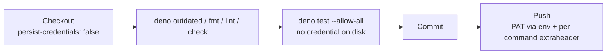

## Summary

`.github/workflows/quality.yml` checked out with the privileged `ACTIONS_PUSH`
PAT and left `actions/checkout`'s credential persistence on, so the PAT sat in
`.git/config` while `deno test --allow-all` ran freshly updated dependencies.
The checkout now sets `persist-credentials: false`, and the PAT is re-introduced
only at the `Push Changes` step through its `env:` map and a per-command
`http.https://github.com/.extraheader` — the same pattern
`update-package-version.yml` already uses. Closes #37.

## Evidence

- Added
  `test/QualityWorkflow.ts::quality workflow checkout does not persist the push PAT to disk`
  which reproduces the flaw: it fails against the unfixed workflow (the checkout
  step had no `persist-credentials`) and passes after the fix.
- Added
  `test/QualityWorkflow.ts::quality workflow re-introduces the push PAT only at the push step`
  which fails against the unfixed workflow (`git push origin` relied on the
  persisted credential) and passes after the fix; it also asserts no other
  `run:` step — including the `--allow-all` test step — is handed a secret.
- Both were observed red before the workflow edit and green after;
  `./quality.sh` passes (24 tests).

**Original trigger closed:** the checkout no longer writes the PAT to
`.git/config`, and the only step that receives it is the final push, which reads
it from `env:` and passes it for that single `git` invocation. No step that
executes repository or dependency code has the token on disk or in its
environment, so there is no trivial bypass.

This is a CI-only change with no UI to screenshot.

## Test Plan

- `deno test --allow-all test/QualityWorkflow.ts` — 7 passed
- `./quality.sh` — 24 passed

🤖 Generated with [Claude Code](https://claude.com/claude-code)
