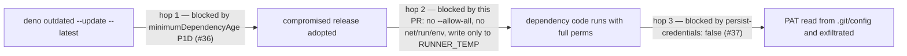

# PR Summary — Issue #38

## Summary

Closes #38

Breaks the remaining hop of the exploit chain (unquarantined update →
`--allow-all` test exec → PAT theft) in `quality.yml`. Hops 1 (#36, dependency
quarantine) and 3 (#37, `persist-credentials: false`) already landed on this
milestone branch. This PR replaces `deno test --allow-all` with least privilege:

- no `--allow-net` / `--allow-run` / `--allow-env` / `--allow-ffi` — a compromised
  dependency cannot exfiltrate, spawn `git`/`curl`, or read secrets from the env;
- `--allow-write` scoped to `$RUNNER_TEMP` (with `TMPDIR` pointed there) — it
  cannot rewrite tracked files (e.g. `.github/workflows/*`) that the later
  Commit/Push steps would publish with the PAT;
- `--allow-read` scoped to the workspace and `$RUNNER_TEMP`.

- [x] Failing regression tests written first
- [x] Test step narrowed to least privilege
- [x] `./quality.sh` green (27 passed)

## Evidence

Regression tests (added in this diff), each **fails on the unfixed workflow**
(`run: deno test --allow-all test/*.ts`) and **passes after the fix**:

- `test/QualityWorkflow.ts::quality workflow runs tests without --allow-all`
  — failed with `AssertionError: deno test must not be granted --allow-all`.
- `test/QualityWorkflow.ts::quality workflow confines test writes to a temp directory`
  — failed with `AssertionError: --allow-all grants unscoped write access`.
- `test/QualityWorkflow.ts::quality workflow breaks every hop of the issue #38 exploit chain`
  — failed with `AssertionError: deno test must not run with --allow-all`;
  asserts all three hops are broken together.

Supporting (pre-existing) tests for the other hops:
`test/QualityWorkflow.ts::deno.json quarantines external dependencies for at least 24 hours`,
`test/QualityWorkflow.ts::quality workflow checkout does not persist the push PAT to disk`.

**Original trigger closed:** a newly published malicious release can no longer
be adopted within 24h, and even if adopted it now runs in `deno test` without
network, subprocess, env or FFI access and cannot write outside
`$RUNNER_TEMP`; the PAT is not on disk and only the push step receives it.
No trivial bypass: the tests parse every `deno test` line in the job and reject
`-A`, `--allow-all`, and any net/run/env/ffi/import grant, and any unscoped or
non-temp `--allow-write`.

Out of scope: `quality.sh` (local developer gate, no secrets) still uses
`--allow-all`; it is not part of the CI attack surface.

## Test Plan

- `deno test --allow-read test/QualityWorkflow.ts` — 10 passed (3 red before the fix).
- Simulated the exact Test step with `RUNNER_TEMP=$(mktemp -d)` — 27 passed, exit 0.
- `./quality.sh < /dev/null` — lint, check, fmt, 27 tests passed.

🤖 Generated with [Claude Code](https://claude.com/claude-code)
