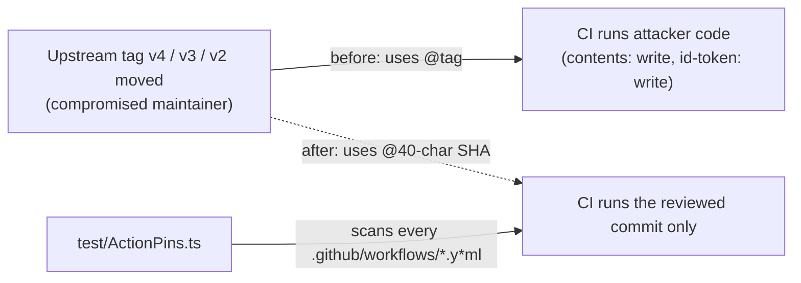

# PR Summary — Issue #39

## Summary

Closes #39

Pins every remaining mutable-tag GitHub Action (CWE-494) to a 40-character
commit SHA, with the exact release tag in a trailing comment. It also sets
`persist-credentials: false` on the edited checkouts, since none of these jobs
pushes over git.

| Workflow                | Action                             | Was   | Now (SHA, `# tag`)      |
| ----------------------- | ---------------------------------- | ----- | ----------------------- |
| `codeql.yml`            | `actions/checkout`                 | `@v4` | `11d5960a…` `# v4.4.0`  |
| `codeql.yml`            | `github/codeql-action/init`        | `@v3` | `1190a975…` `# v3.38.2` |
| `codeql.yml`            | `github/codeql-action/analyze`     | `@v3` | `1190a975…` `# v3.38.2` |
| `dependency-review.yml` | `actions/checkout`                 | `@v4` | `11d5960a…` `# v4.4.0`  |
| `dependency-review.yml` | `actions/dependency-review-action` | `@v4` | `2031cfc0…` `# v4.9.0`  |
| `github-release.yml`    | `actions/checkout`                 | `@v4` | `11d5960a…` `# v4.4.0`  |
| `github-release.yml`    | `softprops/action-gh-release`      | `@v2` | `3bb12739…` `# v2.6.2`  |
| `publish.yml`           | `actions/checkout`                 | `@v4` | `11d5960a…` `# v4.4.0`  |

Each SHA was resolved in this run with
`gh api repos/<owner>/<repo>/commits/<tag> --jq .sha`. The major tag and the
exact tag resolved to the same commit each time. Every pin stays on the major
version the workflow already used, so behaviour does not change.

The issue also lists `quality.yml` and `spellcheck.yaml`, but both were already
SHA-pinned on this milestone branch.

- [x] Failing regression test written first
- [x] 8 references pinned, SHAs resolved via `gh api`
- [x] `./quality.sh` green (30 passed)

## Evidence

Regression test, added in this diff:

- `test/ActionPins.ts::every workflow action is pinned to a commit SHA`
  - **Before the fix:** fails with
    `AssertionError: actions must be pinned to a 40-char commit SHA`, listing
    all 8 unpinned references.
  - **After the fix:** passes.

Supporting tests:

- `test/ActionPins.ts::isPinned rejects tags, branches and malformed SHAs`
- `test/ActionPins.ts::isPinned accepts SHA pins, local and docker references`

**Original trigger closed:** no workflow resolves an action through a mutable
tag any more. A moved or hijacked tag cannot change the code that runs in the
`contents: write` release job or the `id-token: write` publish job.

**No trivial bypass:**

- The test parses every workflow file in `.github/workflows/`, so a new workflow
  is covered automatically.
- It checks step-level and job-level (reusable workflow) `uses:` references.
- It accepts only `@` followed by exactly 40 lowercase hex characters at the end
  of the reference, so short SHAs, branches and tags are all rejected.
- It fails if the scan finds no references, so it cannot pass vacuously.

## Test Plan

- `deno test --allow-all test/ActionPins.ts`: 1 failed before the fix (8
  unpinned references) and 3 passed after.
- `./quality.sh < /dev/null`: lint, check and fmt ran, and 30 tests passed.

🤖 Generated with [Claude Code](https://claude.com/claude-code)
