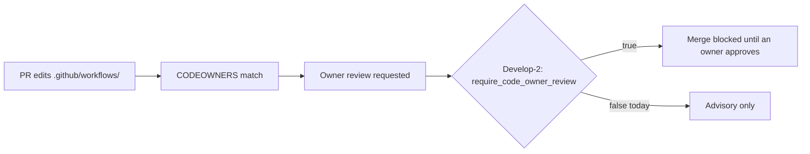

# PR Summary — Issue #53

## Summary

Adds `.github/CODEOWNERS` so every privileged CI path has a named owner:
`/.github/workflows/`, `/.github/actions/` and the CODEOWNERS file itself.
Closes #53.

Owners are the repository admins (`@nleck @Green-Beret @stservice`), listed
directly. No team is granted access to TagsTS (the repo teams API returns 404),
and GitHub silently ignores an owner without write access, so a team handle such
as `@stSoftwareAU/developers` would not have been enforced.

A new test, `test/Codeowners.ts`, reads the file from whichever of GitHub's
three recognised locations holds it, applies GitHub's last-match-wins rule, and
fails if any file under `.github/workflows/` (or a composite action, or
CODEOWNERS itself) is left without a valid `@user` / `@org/team` owner — so a
later owner-less override cannot quietly strip coverage.

## Branch protection on `Develop`

Read from the live rulesets (`gh api repos/stSoftwareAU/TagsTS/rulesets/…`):

| Recommendation in the issue     | Current state (`Develop-1` / `Develop-2`)    |
| ------------------------------- | -------------------------------------------- |
| At least one required approval  | Already on — 1 approval                      |
| Block force-push                | Already on — `non_fast_forward`              |
| Block branch deletion           | Already on — `deletion`                      |
| Linear history                  | Already on — `required_linear_history`       |
| Require review from Code Owners | **Off** — `require_code_owner_review: false` |

The one remaining setting is a repo-admin change the worker account (write
access) cannot make: a TagsTS admin must set **Require review from Code Owners**
on the `Develop-2` ruleset. Until then CODEOWNERS auto-requests the owners'
review but does not block the merge.

## Evidence

No UI. `test/Codeowners.ts` was run before the CODEOWNERS file existed and
failed
(`no CODEOWNERS file at any of: CODEOWNERS, .github/CODEOWNERS,
docs/CODEOWNERS`);
after adding it, all three tests pass. `./quality.sh` passes (37 tests).

## Test Plan

- Added `test/Codeowners.ts`:
  - every workflow file has a valid code owner
  - composite actions and CODEOWNERS itself have a code owner
  - `ownersOf` applies the last matching rule (including an owner-less override)
