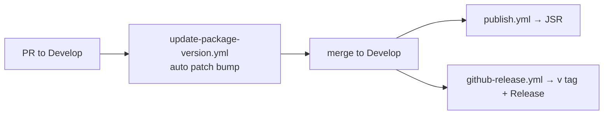

# PR Summary — Issue #56

## Summary

Closes #56. Adds a short `CONTRIBUTING.md` and a Keep a Changelog
`CHANGELOG.md`, linked from the README.

- [x] `CONTRIBUTING.md` — `Develop` integration branch (merge = JSR publish +
      GitHub Release), `./quality.sh` gate, and how `update-package-version.yml`
      auto-increments the patch version (same / ahead / behind table).
- [x] `CHANGELOG.md` — `[Unreleased]` section, one entry per release from
      `[1.0.15]` to `[1.0.21]` (each verified against the PR merge commit that
      release tagged), and `[1.0.14] and earlier` deferred to the GitHub
      Releases page.
- [x] README Development section links both files.
- [x] `test/ContributingDocs.ts` contract test.

## Evidence

Docs-only change; no visual surface, so no screenshot.

- `deno test --allow-all test/ContributingDocs.ts` → `ok | 4 passed | 0 failed`
  (the first three failed 3/3 before the docs existed; deleting a changelog link
  reference fails with `heading [1.0.14] has no link reference`; the fourth
  failed while `[Unreleased]` still compared from v1.0.15).
- `./quality.sh` → exit 0, `ok | 63 passed | 0 failed`.
- `markdownlint-cli2` → 0 issues; `cspell` with the repo config → 0 issues.

## Test Plan

- The contract test parses `update-package-version.yml` with `@std/yaml` and
  asserts `CONTRIBUTING.md` names each `pull_request` target branch, so a branch
  rename cannot leave the guide stale.
- It asserts `CHANGELOG.md` has `## [Unreleased]` and that every version heading
  has a link reference, and that the `[Unreleased]` compare link starts from the
  newest version heading in the file, so a new release entry cannot leave it
  comparing from an older tag. It deliberately does not pin the current
  `deno.json` version, which the auto-bump changes on every PR.
