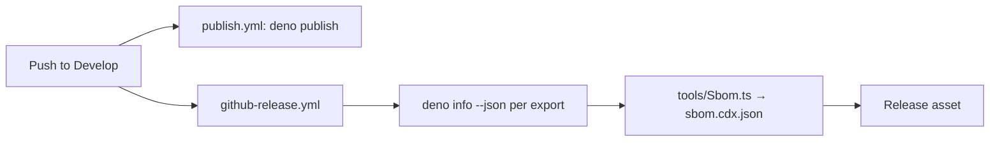

# PR Summary — Issue #57: release SBOM

## Summary

Closes #57.

Every GitHub release now carries `sbom.cdx.json`, a deterministic CycloneDX 1.5
SBOM of the resolved dependency graph of each `deno.json` export. Diffing two
releases' SBOMs shows exactly which dependencies changed.

- `tools/Sbom.ts` runs `deno info --json` for every export and merges the jsr
  and npm packages. It emits sorted components with purls, and no timestamp or
  serial number, so the output diffs cleanly. Malformed graph output throws.
- `github-release.yml` sets up pinned Deno (`v2.9.6`, `setup-deno` SHA resolved
  this run), generates the SBOM and attaches it with the existing
  `action-gh-release` `files:` input. `fail_on_unmatched_files: true` means a
  missing SBOM fails the release instead of being skipped.
- The SBOM is generated in the release job rather than `publish.yml`, because
  only the release job can attach assets (`contents: write`). The OIDC publish
  job keeps `contents: read`, and both jobs run on the same Develop push.
- README gains a "Release SBOM" section with a flow diagram and a diff recipe.
  `cspell.json` gains `purl`/`sbom`.



### Deno regression avoided

- The SBOM is built by a Deno script from `deno info --json`, not an npm
  CycloneDX generator or `npx`.

## Evidence

This is a backend/CI change with no UI. Local run of the tool:

```json
{
  "bomFormat": "CycloneDX",
  "specVersion": "1.5",
  "metadata": { "component": { "purl": "pkg:jsr/%40stsoftware/tags@1.0.15" } },
  "components": [
    {
      "name": "@std/cli",
      "version": "1.0.32",
      "purl": "pkg:jsr/%40std/cli@1.0.32"
    },
    {
      "name": "@std/internal",
      "version": "1.0.14",
      "purl": "pkg:jsr/%40std/internal@1.0.14"
    }
  ]
}
```

(Abridged: `type` and `bom-ref` are omitted here.)

## Test Plan

- [x] `test/ReleaseSbom.ts` was written first and failed against the missing
      tool. It covers dedupe and sort, determinism, empty graphs, malformed
      input, `exports` parsing, and the release workflow generating and
      attaching the SBOM.
- [x] `deno fmt`, `deno lint` and `deno check` pass.
- [x] `timeout 900 ./quality.sh < /dev/null` passes: 40 tests, 0 failures.
- [ ] After merge, confirm the next `Release vX.Y.Z` lists `sbom.cdx.json`.

## Security self-check

- [x] Actions are SHA-pinned (resolved with `gh api`), and Deno is an exact
      version.
- [x] The job permissions are unchanged. The tool runs with
      `--allow-read=deno.json --allow-run=deno` only.
- [x] No secrets or hidden files are staged.
