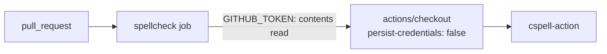

# PR Summary — Issue #59

## Summary

Closes #59. The `spellcheck` job in `.github/workflows/spellcheck.yaml` had no
`permissions:` block, so it ran with the repository's default `GITHUB_TOKEN`
scopes. It now declares `contents: read` at both workflow and job level, and the
checkout step sets `persist-credentials: false` because the job never pushes.

- [x] Contract test `test/SpellcheckWorkflow.ts` written first (red: 0/2)
- [x] Workflow restricted to `contents: read` (workflow + job)
- [x] Checkout no longer persists credentials
- [x] Action SHA pins re-verified with `gh api` (checkout v4.3.1, cspell-action
      v6.11.1) — unchanged

## Evidence

- `deno test --allow-read test/SpellcheckWorkflow.ts test/ActionPins.ts` → 5
  passed, 0 failed (was 2 failed before the fix).
- `actionlint .github/workflows/spellcheck.yaml` → clean.
- `deno fmt --check` and `deno lint` → clean.

## Test Plan

- [x] `deno test --allow-read test/SpellcheckWorkflow.ts`
- [x] `actionlint .github/workflows/spellcheck.yaml`
- [ ] Spellcheck check passes on this PR in CI
