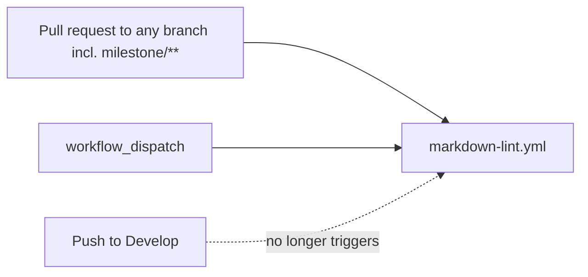

# PR Summary — Issue #60

## Summary

Closes #60. `markdown-lint.yml` no longer runs on push to `Develop` (or
`main`/`master`). It now runs on pull requests to any base branch, including
`milestone/<slug>`, and on manual `workflow_dispatch`. While editing the file it
was also brought in line with the fleet workflow checks: job-level
`contents: read`, `persist-credentials: false` on checkout, and an exact pin for
`markdownlint-cli2`.

## Spec

### Intent and Rationale

- A lint gate belongs on the PR. Running it again after the merge to the default
  branch only spends runner minutes and cannot block anything.
- `workflow_dispatch` keeps a manual run available now that the push trigger is
  gone.

### Essential Design Decisions

- `push:` is removed entirely rather than narrowed. No non-default branch needs
  a push-time lint, because every change reaches it through a PR.
- The `pull_request` filter changes from `"*"` to `"**"`. `*` does not match
  `/`, so PRs into `milestone/<slug>` were silently skipped.
- `markdownlint-cli2@0.23.3` is the latest tag (2026-09-20), which is past the
  24h external quarantine.

### Undiscoverable Facts

- The repository's default branch is `Develop` (from
  `gh repo view --json defaultBranchRef`).

## Evidence

This change is CI-only, so there is no visual surface.

- `deno test --allow-all test/MarkdownLintWorkflow.ts` on the base workflow gave
  `FAILED | 4 passed | 5 failed`. After the fix it gave `ok`.
- `actionlint -color .github/workflows/markdown-lint.yml` exited 0.
- `./quality.sh` gave `ok | 68 passed | 0 failed`.
- **Docs sweep:** I grepped `README.md`, `CONTRIBUTING.md` and `docs/`
  (excluding `docs/archive/`) for `markdown-lint|markdownlint|push to|on push`.
  No files needed updating. The remaining hits stay true:
  - `CONTRIBUTING.md:11` describes `publish.yml`, which is unchanged.
  - `README.md:217` is the publish diagram, which is also unchanged.

## Test Plan

- `test/MarkdownLintWorkflow.ts` gains five tests. Each parses the workflow with
  `@std/yaml`, and each was red against the base workflow:
  - there is no `on.push`, `pull_request` is present, and its branch filter
    matches `milestone/**`;
  - `workflow_dispatch` is present;
  - `contents: read` is set at workflow and job level;
  - checkout sets `persist-credentials: false`;
  - `npm install` pins `markdownlint-cli2@<x.y.z>`.
- No assertions were removed.
- Branch outcomes: none added. The only conditional is the test-side
  `branches !== undefined` guard, which copies the existing
  `ActionlintWorkflow.ts` pattern.

🤖 Generated with [Claude Code](https://claude.com/claude-code)
