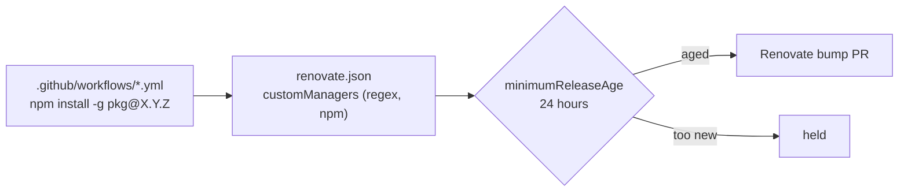

# PR Summary — Issue #70

## Summary

The Markdown Lint job installs `markdownlint-cli2` from a `run:` step. A `run:`
step is not a manifest, so no dependency manager tracked that install, and the
24h quarantine did not reach it.

- The exact pin (`npm install -g markdownlint-cli2@0.23.3`) is already on
  `Develop`: PR #90 (#60) added it, together with the
  `markdown-lint job installs a pinned markdownlint-cli2` test. 0.23.3 is the
  latest release (published 2026-09-20, well outside the 24h window), so the
  workflow file is unchanged here.
- Adds `renovate.json` with a regex `customManagers` entry covering
  `.github/workflows/*.y(a)ml`. It matches exact
  `npm install|i|add [-g|--global]
  <pkg>@X.Y.Z` pins, with the `npm`
  datasource, so the pin is kept current and is not left to go stale.
- Sets a top-level `minimumReleaseAge: "24 hours"`, so those bumps (and any
  other Renovate bump) serve the quarantine.
- Disables Renovate's `deno` manager, because Deno dependencies are governed by
  `deno.json` `minimumDependencyAge`.
- Adds `test/RenovateConfig.ts`, which compiles the config's real file pattern
  and match string and runs them against the real workflow.

No `# best-practice-ignore` suppression is used. `--ignore-scripts` was
deliberately not added, as the issue asks.

Closes #70

- [x] Confirm the pin already landed (#90)
- [x] Failing test first (`test/RenovateConfig.ts`, red on base)
- [x] Add `renovate.json` customManagers entry
- [x] `./quality.sh` green

## Spec

### Intent and Rationale

Pinning alone freezes the version. Without a manager that can see the pin, it
would never be bumped and would eventually sit on a vulnerable release. The
Renovate entry keeps the pin moving, and only through the 24h quarantine.

### Essential Design Decisions

- **The config follows the fleet shape.** It uses the same shape as
  `stSoftwareAU/VibeCoder` and `stSoftwareAU/GRQ-actual-validation`:
  `config:recommended`, a top-level 24h `minimumReleaseAge`, and the deno
  manager disabled.
- **The match string accepts only exact `X.Y.Z` pins.** A trailing negative
  look-ahead `(?![\w.-])` stops a pre-release or a longer version from being
  half-captured. Floating installs (`pkg`, `pkg@latest`, `pkg@^X.Y.Z`) are not
  matched, so Renovate never "manages" an unpinned install.
- **The test executes the real regexes.** It compiles them from the real
  `renovate.json` and runs them on the real workflow text, rather than matching
  the config's source text.

### Undiscoverable Facts

- No Renovate PR has been opened on this repo (nor on VibeCoder or
  GRQ-actual-validation) by `app/renovate`. Whether the Renovate app is enabled
  for the org is a GitHub App installation setting that this run cannot see. The
  config is ready for when it is enabled.
- `quality.sh` formats only `src test ./*.ts`, so `renovate.json` was formatted
  once by hand with `deno fmt`.

## Evidence

Backend/CI configuration only: there is no web surface to screenshot.

- Red on base (before `renovate.json` existed):
  `deno test -A test/RenovateConfig.ts` → `FAILED | 0 passed | 5 failed`
  (`NotFound … readfile 'renovate.json'`).
- Green after:
  `deno test -A test/RenovateConfig.ts test/MarkdownLintWorkflow.ts` →
  `ok | 14 passed | 0 failed`.
- `./quality.sh < /dev/null` → `ok | 75 passed | 0 failed`, exit 0.

**Docs sweep** — grep: `renovate`, `markdownlint`, `minimumReleaseAge`, `minimumDependencyAge`, "quarantine", "dependenc"; section: `README.md#dependency-quarantine`; updated: `README.md`

The name greps (`renovate`, `markdownlint`, `minimumReleaseAge`) had no hits in
`README.md`, `CONTRIBUTING.md`, `SECURITY.md`, `CHANGELOG.md` or `docs/`
(excluding `docs/archive/`). The surface greps ("quarantine",
`minimumDependencyAge`) found the README's `### Dependency quarantine` section,
which is the manual section for this surface. I read it through and none of its
sentences is made false. It did describe only the `deno.json` side, though, so I
added a paragraph. It says that workflow `run:` installs are pinned exactly,
that `renovate.json`'s `customManagers` entry bumps them behind a 24h
`minimumReleaseAge`, and that Renovate's `deno` manager is disabled.

## Test Plan

- `test/RenovateConfig.ts`:
  - The 24h `minimumReleaseAge` is set.
  - The file pattern matches `.github/workflows/markdown-lint.yml` but not
    `src/workflows/x.yml` or `.github/workflows/sub/dir.txt`.
  - Exactly one match in the real workflow: `markdownlint-cli2` at the version
    the workflow pins.
  - No match for unpinned, `@latest` or `@^` range installs.
  - Matches a scoped package (`@scope/pkg@1.2.3`) and the `npm i --global`
    alias.
- Mutations, each confirmed red then restored:
  - Requiring a leading `@` in `depName` turns 2 tests red.
  - Changing `managerFilePatterns` to `/^src/` turns 1 test red.

Branch outcomes: none added. The change is a configuration file and tests, with
no new production branch.

🤖 Generated with [Claude Code](https://claude.com/claude-code)
