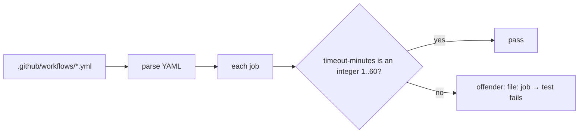

## Summary

Every job in the repository's CI workflows now sets a job-level
`timeout-minutes`, so a hung step fails fast instead of holding a runner for
GitHub's 360-minute default. A new test, `test/JobTimeouts.ts`, fails the gate
when any job omits the key or sets it outside 1–60 minutes. Closes #75.

## Spec

### Intent and Rationale

- Without a timeout, a wedged network call or an unexpected prompt holds a
  runner for up to six hours. Recent runs finish in 10–70 s, so 10–15 minutes
  gives plenty of headroom.
- The timeout is a workflow invariant, so it gets a validator test like
  `test/ActionPins.ts`, not just a YAML edit.

### Essential Design Decisions

- 10 minutes for the lint, scan, release and publish jobs. 15 minutes for
  `quality` (`deno test` with leak tracing) and `semgrep` (pulls its container
  image). Both values follow the existing `update-package-version.yml` value
  of 15.
- The validator accepts only integers from 1 to 60 (`MAX_TIMEOUT_MINUTES`). A
  missing key, a string, zero, a negative, a fraction or anything above 60 is
  rejected, so nobody can reintroduce a near-default timeout.

### Undiscoverable Facts

- The issue lists `.github/workflows/codeql.yml`, but no such file exists.
  CodeQL runs through GitHub's default setup: the advanced workflow was removed
  in #87, see `CHANGELOG.md` 1.0.16. There is no job to change, and its timeout
  is managed by GitHub.
- The issue counts 11 workflows, but the head has 12 (`actionlint.yml` was added
  in #86). Its `actionlint` job had the same gap and is fixed here too.
- Run durations come from `gh run list --repo stSoftwareAU/TagsTS --limit 60`:
  the longest recent run per workflow was CodeQL 70 s, dependency review 46 s,
  Semgrep 34 s, and the rest 10–28 s.

## Evidence

This is a CI-configuration and test change only, with no UI. Each workflow gets
one added line, `timeout-minutes: N`, directly after `runs-on:`.

**Docs sweep** — grep: `timeout`, `360-minute`, `runs-on` over the root manuals
(README, CONTRIBUTING, SECURITY, CHANGELOG) and test header comments, re-run on
the final head; section: none, because no manual documents per-job CI settings.
That grep has no hits. The worker also matched the manuals' file names, and
these hits were read and left unchanged:

- `README.md:167` — still true because CONTRIBUTING.md still describes the
  branch model and automatic version bump; job timeouts change neither.
- `README.md:168` — still true because CHANGELOG.md still holds the release
  notes; this CI-only change adds no released behaviour.
- `README.md:243` — still true because SECURITY.md's reporting route, response
  times and supported versions are untouched by workflow timeouts.
- `test/ReadmeExamples.ts:1` — still true because the README code snippets it
  verifies are unchanged.
- `test/ContributingDocs.ts:1` — still true because CONTRIBUTING.md and
  CHANGELOG.md still match the workflow triggers and package version it checks;
  adding `timeout-minutes` changes neither.

## Test Plan

- Added `test/JobTimeouts.ts`:
  - `jobsWithoutTimeout accepts valid timeouts` (10 and the boundary 60)
  - `jobsWithoutTimeout reports a job missing timeout-minutes`
  - `jobsWithoutTimeout rejects invalid timeout values` (0, -5, 61, 360, 2.5 and
    `"10"`, each with the same job accepted once made legal)
  - `every workflow job sets timeout-minutes` (scans all 12 workflows, and fails
    if it finds no jobs to check)
- Red check: with the base-branch workflow files restored and the new test kept,
  `every workflow job sets timeout-minutes` failed and listed all 10 offending
  jobs. With the change applied, it passes.
- No existing test was edited, so no assertions were removed.
- `./quality.sh < /dev/null` on the head: `ok | 121 passed | 0 failed` (after
  merging `Develop`).

**Branch outcomes:**

- `test/JobTimeouts.ts:19` `Number.isInteger(timeout)` false (missing, string or
  fraction) — `jobsWithoutTimeout reports a job missing timeout-minutes` and
  `rejects invalid timeout values` — replacing it with `true` turned the suite
  red.
- `test/JobTimeouts.ts:20` `timeout > 0` false (0, -5) —
  `rejects invalid timeout values` — replacing it with `true` turned the suite
  red.
- `test/JobTimeouts.ts:21` `timeout <= MAX_TIMEOUT_MINUTES` false (61, 360) —
  `rejects invalid timeout values` — replacing it with `true` turned the suite
  red.
- `test/JobTimeouts.ts:22` valid outcome —
  `jobsWithoutTimeout accepts valid timeouts` and the repo scan.

🤖 Generated with [Claude Code](https://claude.com/claude-code)
